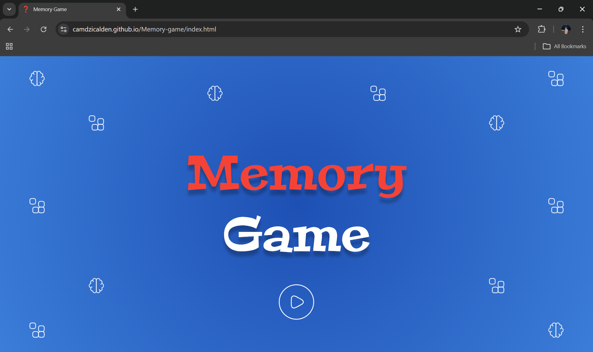
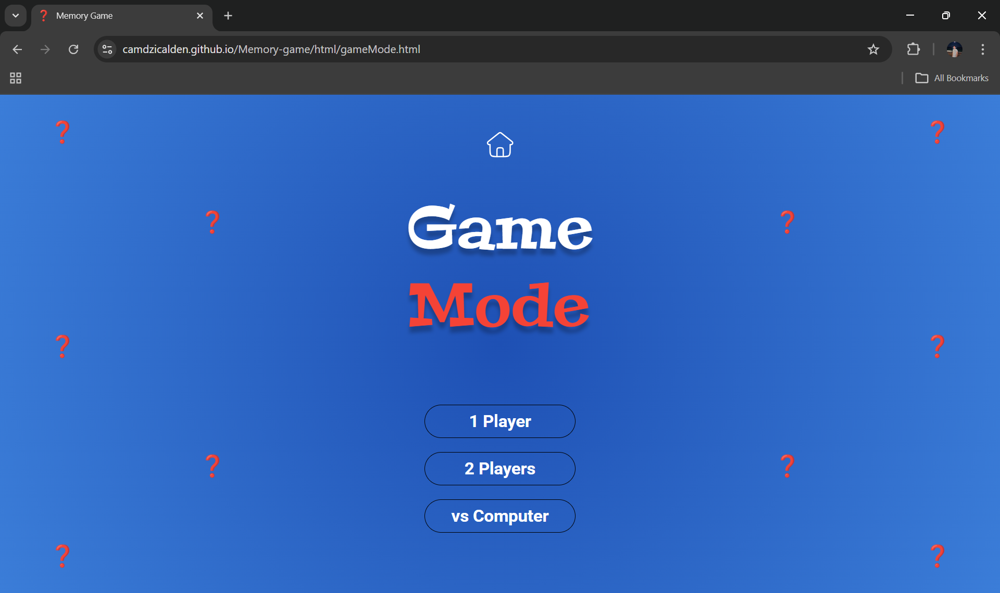
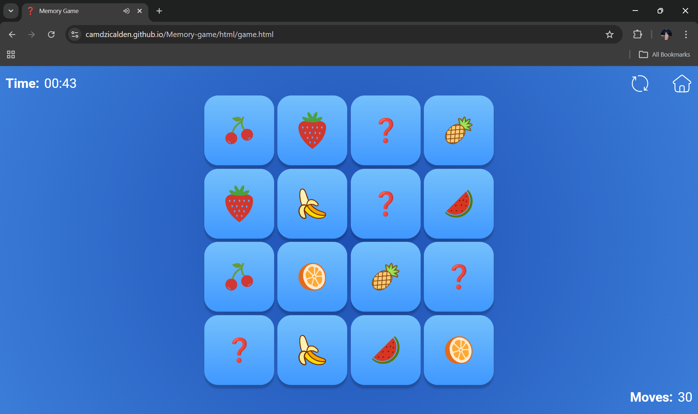
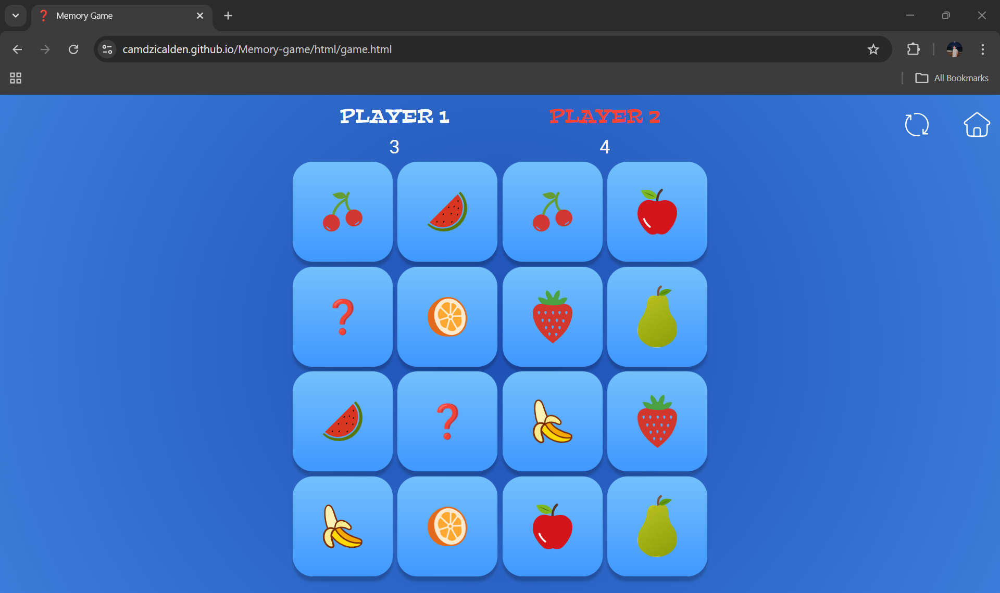
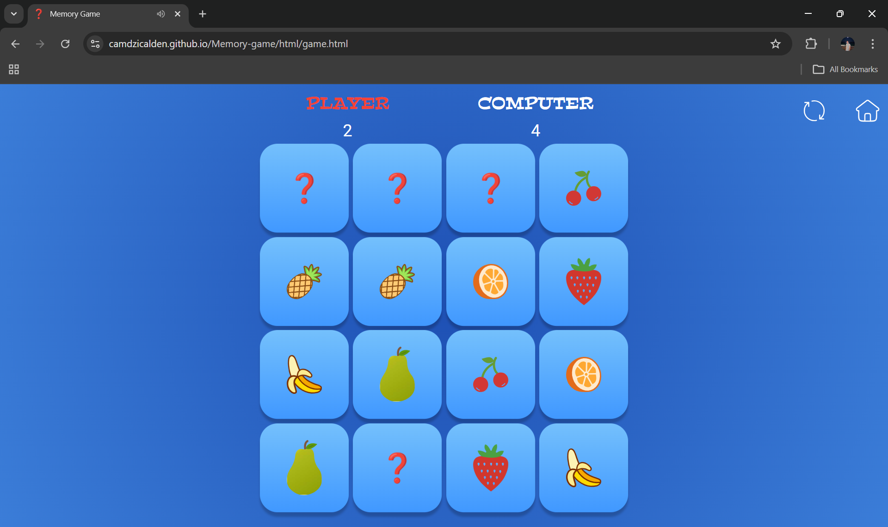

# 🧠 Memory Game

  
  
  

A fun and interactive memory matching game built with **HTML, CSS, and JavaScript**!  
Challenge yourself or compete with friends and see who has the sharpest memory.  
Play in single-player, two-player, or vs computer mode—all in a clean, modern interface.
  

🌐 **Try it now:** [https://camdzicalden.github.io/Memory-game/index.html](https://camdzicalden.github.io/Memory-game/index.html)

 

  
   <i>Landing page</i>     

 

---

## Table of Contents 📑

- [Game Modes 🎮](#game-modes-)
- [Technologies Used 🛠️](#technologies-used)
- [How to use 🚀](#how-to-use-)
- [Features ✨](#features-)
- [Future Improvements 🔮](#future-improvements-)
- [Author 👤](#author-)
- [License 📄](#license-)

---

## Game Modes 🎮

 

  
   <i>Game Mode</i>     

 

### 🧍 1 Player Mode

- Play solo and match all card pairs in 1.5 minutes.
- Try to complete the game in the fewest moves possible.

 

    
     <i>1 Player</i>

 

### 👥 2 Player Mode

- Two players take turns.
- Each correct match earns a point and another turn.
- The player with the most matched pairs wins.

 

    
     <i>2 Players</i>

 

### 🤖 VS Computer Mode

- Play against the computer.
- The computer automatically makes its move after the player.
- The winner is the one with the most matched pairs.

 

    
     <i>Vs Computer</i>

 

---

<h2 id="technologies-used">Technologies Used 🛠️</h2>

- **HTML** – Game structure
- **CSS** – Styling and layout
- **JavaScript** – Game logic and interactions

---

## How to use 🚀

1. Clone or download the repository.
2. Open the project folder.
3. Open `index.html` in any modern web browser.
4. Select a game mode.
5. Click on cards to flip them and find matching pairs.

---

## Features ✨

- Three different game modes
- Turn-based gameplay
- Simple and clean user interface
- Card flip animations
- Score tracking for multiplayer modes
- Computer opponent logic

---

## Future Improvements 🔮

- Add difficulty levels

- Add online mode for playing on different devices

---

## Author 👤

**Alden Čamdžić**

---

## License 📄

<i>This project is open-source and free to use for educational purposes.</i>
